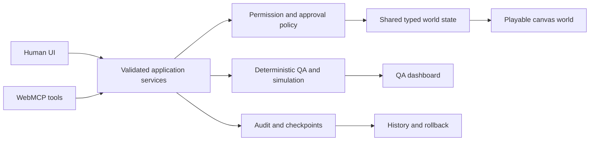

# FORGE

**Human-Agent World Laboratory**

FORGE is a WebMCP-first hackathon application where a human and an AI agent collaboratively inspect, modify, test, repair, and evolve a small playable medieval world. The browser UI and every registered agent tool call the same typed application services, so visible state, QA results, approvals, audit records, checkpoints, and rollbacks stay consistent.

## Overview

The demonstration world, **Ashen Reach**, includes the town of Greyhaven, Cemetery Road, and the Forgotten Crypt. The player can accept *The Blacksmith's Daughter*, travel between locations, fight three enemy archetypes and the Warden of Ash, collect items, open a progression gate, rescue Mira Thorn, and complete the quest.

The seeded demo intentionally places the crypt key behind the door that requires it. FORGE’s graph-based QA engine detects that real circular dependency, an agent can propose a narrow item-spawn repair, the human can approve it, and deterministic regression proves the route is reachable.

## Why FORGE

Traditional agents infer meaning from pixels and DOM structure. FORGE exposes explicit, typed capabilities through WebMCP. The result is a more reliable interaction model:

- humans supply goals, constraints, judgment, and approval;
- agents inspect, simulate, recommend, and invoke structured capabilities;
- the application validates permissions and inputs at the service boundary;
- every call is observable and auditable;
- meaningful changes have checkpoints and can be rolled back.

## What WebMCP Enables

FORGE registers browser-native tools through `document.modelContext.registerTool()`. Registration follows the current WebMCP document lifecycle and uses an `AbortSignal` for cleanup. In browsers without the preview API, the application remains fully usable and the `/webmcp` inspector still documents every capability.

WebMCP currently requires a supported Chromium preview or origin-trial environment. For local testing, enable the browser’s WebMCP testing flag and use a compatible tool inspector.

## Features

- Playable canvas-rendered medieval world with movement, NPC interaction, quest acquisition, combat, inventory, gates, item collection, and quest completion.
- 30 atomic WebMCP tools across World, Player, Quests, Encounters, Simulation, QA, and Governance.
- OBSERVE, PROPOSE, and AUTONOMOUS permission modes enforced in the shared service layer.
- Human approval queue with approve, reject, and structured parameter modification.
- Seeded combat simulation affected by composition, reinforcements, range, aggression, coordination, and special-attack frequency.
- Measured encounter calibration that searches minimal candidates instead of assuming a requested pressure change was achieved.
- Static reference validation, quest graph validation, progression reachability, and deterministic regression.
- BREAK MY GAME campaign with severity-ranked, reproducible issues and retest support.
- Complete agent activity stream, audit history, checkpoints, rollback, and deterministic reset.
- Polished `/webmcp` registry inspector with schemas and safe example execution.
- Device-local persistence for the repeatable public demo.

## Architecture



The core layers are deliberately small:

- `types/` defines stable domain and governance contracts.
- `data/` creates the canonical seeded world.
- `lib/game/` executes every human and agent action.
- `lib/webmcp/` owns schemas, metadata, and tool handlers.
- `lib/qa/` performs graph and rule analysis.
- `lib/simulation/` runs reproducible combat models.
- `components/` renders the world laboratory and governance surfaces.

## WebMCP Tool Categories

| Category | Representative capabilities |
| --- | --- |
| World | `get_world_state`, `get_location_state`, `get_dungeon_state`, `modify_item_spawn` |
| Player | `get_player_state`, `move_player`, `interact_npc`, `attack_enemy`, `collect_item`, `open_gate` |
| Quests | `get_quests`, `get_quest`, `modify_quest`, `create_quest` |
| Encounters | `get_encounters`, `get_enemy_behavior`, `modify_encounter`, `modify_enemy_behavior` |
| Simulation | `run_playthrough`, `run_combat_simulation`, `analyze_balance` |
| QA | `validate_quest`, `find_progression_blockers`, `run_regression`, `break_my_game` |
| Governance | `get_change_history`, `rollback_change`, `reset_demo_world` |

The exact registry, current JSON schemas, approval requirements, and examples are visible at `/webmcp`.

## Human Approval Model

- **Capability is separate from authority.** The agent can discover and invoke the full registered workflow, but the active permission mode decides whether a call may inspect, propose, or execute.
- **OBSERVE** permits inspection and simulation but denies gameplay mutations.
- **PROPOSE** is the default. Significant agent changes create a proposal and leave gameplay state untouched until a human approves it.
- **AUTONOMOUS** allows registered mutations to execute immediately. Reversible actions still create checkpoints.

Read-only inspection, diagnosis, simulation, and validation can run without interrupting the human. Material world changes use approval by default. Explicit autonomous mode is available for trusted, bounded, reversible operations; invalid, unregistered, or disallowed operations remain blocked in every mode. This keeps routine agent work fluid without treating unrestricted authority as a prerequisite for useful agency.

Approvals, rejections, validation failures, and permission denials are all audit events. Permission enforcement lives in `lib/game/service.ts`, not only in UI controls.

## QA Engine

FORGE separates logical validation from rendering:

1. Reference validation detects missing NPCs, items, locations, enemies, stages, and variables.
2. Quest graph validation detects broken stage transitions.
3. Progression reachability traverses exits and gates while tracking obtainable inventory.
4. Combat simulation uses a seeded PRNG and simplified behavioral combat model.
5. Regression repeats the current-state campaign and compares completion behavior.

The campaign result is derived from live structured state. Moving the crypt key changes reachability and regression results without a hardcoded success switch.

## Audit and Rollback

Every tool call records source, parameters, permission mode, approval status, success, summary, and checkpoint association. Reversible mutations capture a complete gameplay snapshot before execution. Rollback restores the snapshot while preserving governance history, and rollback itself is audited.

## Demo Scenario

1. Open `/lab` and accept Garrick Thorn’s quest.
2. Paste the golden prompt from the persistent judge guide into a native WebMCP agent.
3. Optionally select **Calibrate +25% pressure** to search measured encounter candidates and review the closest minimal proposal.
4. Approve the composition and hazard change.
5. Run **BREAK MY GAME**.
6. Inspect the critical circular key dependency.
7. Select **Propose narrow repair** and approve moving the key to the antechamber.
8. Run regression and confirm the progression layer passes.
9. Open Audit History and demonstrate rollback.
10. Open `/webmcp` and inspect the live registry.
11. Reset the world and repeat the scenario.

## Getting Started

Requirements:

- Node.js 22.13 or newer
- pnpm
- A Chromium WebMCP preview build for native tool discovery (optional for the standard UI)

```bash
pnpm install
pnpm dev
```

Open `http://localhost:3000`.

## Local Development

```bash
pnpm typecheck
pnpm lint
pnpm test
pnpm build
pnpm test:e2e
```

Set `NEXT_PUBLIC_SITE_URL` to the trusted public origin when validating social metadata. Copy `.env.example` to `.env.local`; never commit credentials.

## WebMCP Browser Setup

WebMCP is an evolving browser preview. In a supported Chromium build:

1. Enable `chrome://flags/#enable-webmcp-testing`.
2. Relaunch the browser.
3. Open FORGE directly in the top-level tab.
4. Use a compatible WebMCP inspector or browser agent to discover the registered tools.

FORGE does not implement backend MCP transports. Tools execute client-side in the page and share the same application services as the human UI.

## Testing

The automated core suite covers seeded world state, the circular defect, repair, permissions, approval, rejection, encounter modification, behavior-sensitive deterministic combat, regression, audit recording, checkpoint rollback, reset, schemas, invalid IDs, and the complete rescue flow. A Playwright suite covers landing-to-lab navigation, all 30 WebMCP registrations through a browser API harness, native proposal/approval/regression/rollback/reset, keyboard access, and desktop plus narrow-pane layouts.

The test harness loads the real TypeScript modules through Vite and executes them with Node’s built-in test runner. This avoids duplicated test-only business logic.

## Deployment

The application builds to Cloudflare Worker-compatible ESM through the Sites/Vinext toolchain. Configure the trusted origin and deploy using the repository’s hosting workflow. The public site requires no authentication and stores each visitor’s isolated demo state in browser storage.

No secrets or privileged backend credentials are required.

## Project Structure

```text
app/                 Routes, metadata, and global theme
components/          Game, agent, QA, governance, and UI surfaces
data/                Canonical Ashen Reach fixture
lib/game/            Shared execution, permissions, approvals, audit
lib/webmcp/          Central WebMCP registry and schemas
lib/qa/              Reachability, validation, regression
lib/simulation/      Seeded PRNG and combat simulation
types/               Domain and browser API declarations
tests/               Core and primary-flow automation
public/              Social preview and icons
docs/                Architecture and judging notes
```

## Security Considerations

- Tool inputs fail closed and use stable IDs rather than display labels.
- Mutation permissions are enforced in the service layer.
- High-impact changes require human approval in the default mode.
- Invalid references and impossible state transitions return structured errors.
- The client contains no secrets and sends no world data to an external service.
- WebMCP tools are bound to the document lifecycle and same-origin browser policy.
- Browser persistence is scoped to the visitor’s device and origin.

See [SECURITY.md](SECURITY.md) for reporting guidance and trust boundaries.

## Hackathon Information

FORGE was created for the WebMCP Challenge to demonstrate an agent-native website architecture. The medieval game is intentionally compact: its purpose is to make structured agent inspection, safe modification, QA, approval, and rollback immediately visible.

## License

MIT. See [LICENSE](LICENSE).
