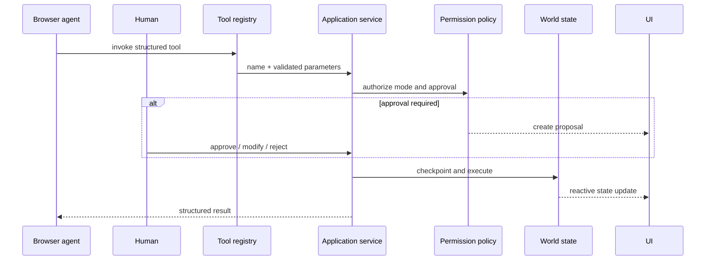

# FORGE Architecture Notes

## Decision Summary

FORGE uses a client-first, deterministic architecture because the challenge scenario needs fast reset, visible browser-native tool execution, and no secrets. The canonical state fixture is cloned into a versioned runtime state. Human controls and WebMCP handlers invoke the same service function.

## State Flow

## Persistence

The public demo stores state in origin-scoped browser storage. This is appropriate for isolated judge sessions and makes reset immediate. It is not a multi-user persistence layer. A production collaborative extension should move governance records and snapshots to an authenticated server datastore, enforce authorization on the server, and add optimistic concurrency controls.

## Simulation Model

The combat model intentionally abstracts graphics. It uses player stats, enemy archetype stats, aggression, range, coordination, target behavior, special frequency, and a seeded PRNG. It is credible enough to show behavioral changes affecting outcomes without pretending to reproduce frame-by-frame combat.

## Rollback Model

Each reversible world mutation captures the gameplay snapshot before execution. Governance records remain append-only from the perspective of rollback, so history is not erased when world state is restored.
